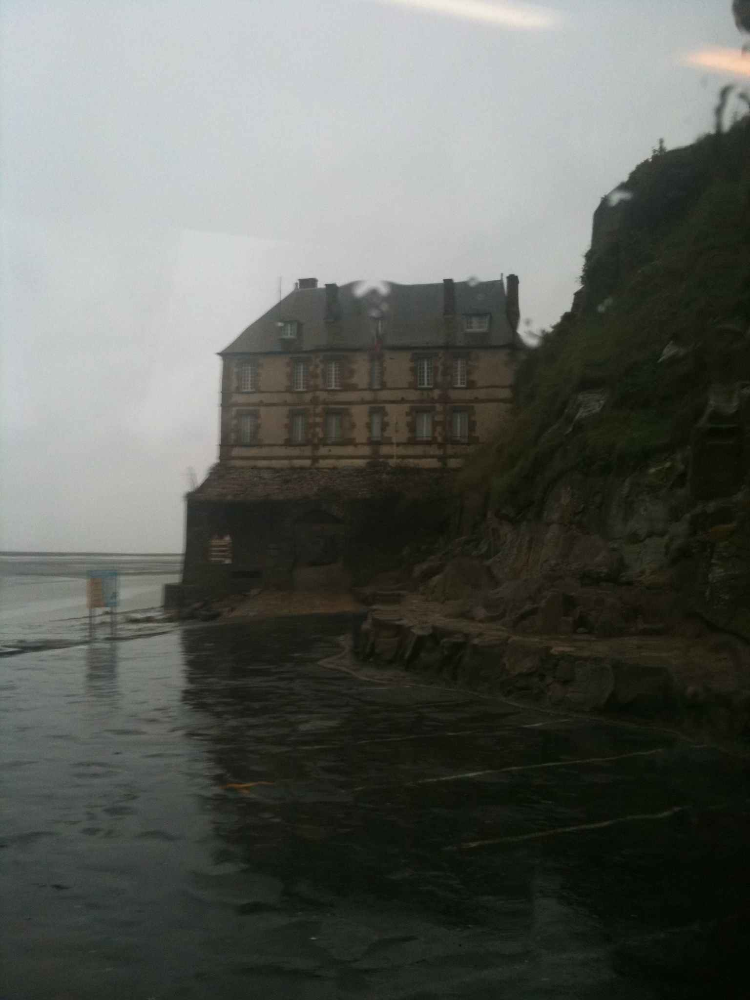
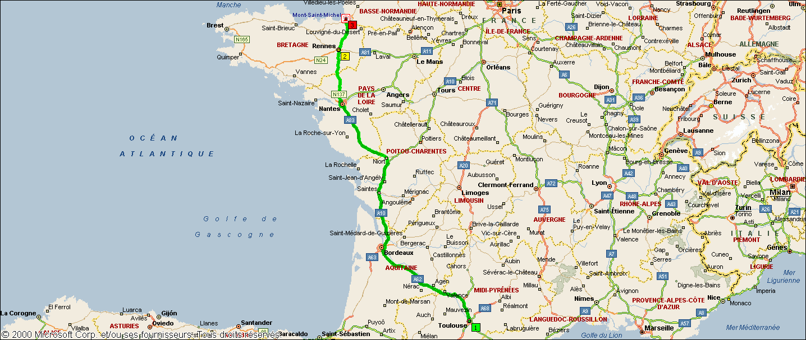

Rapport du projet d'inforensique
================================

Outils et commandes nécessaires
-------------------------------

#. ``exiftool`` pour l'analyse des images

#. ``ls -l`` pour vérifier les dernières dates de modifications d'un fichier

#. ``file`` pour connaître le type réel d'un fichier

#. ``xxd`` convertit en représentation hexadécimale et inversement 

#. ``photorec`` pour récupérer les fichiers supprimés d'un disque mais on perd le nom du fichier

#. ``sleuthkit`` boîte à outils inforensique

    * ``fls <file.img>`` pour lister tous les fichier supprimés ou non se trouvant sur l'image du
    disque, ainsi que leur index

    * ``icat <file.img> <inodeOfDeletedFile> > fileout`` permet de récupérer le fichier indexé par
    un numéro de noeud donné.  

    * ``mactime`` retrace en ASCII la chronologie de modification des fichiers se trouvant dans une
      image

#. ``7z`` du paquet **p7zip-full** pour décompresser une archive 7z

#. ``rarcrack`` pour trouver le mot de passe utilisé pour chiffrer une archive 7z

#. ``fcrackzip`` pour trouver le mot de passe utilisé pour chiffrer une archive zip

À partir de ces commandes on tire les premières informations suivantes :

* Le fichier **the whirling dancers.mp3** n'est pas un fichier audio mp3 comme son extension
l'indique. C'est un fichier de données (*data file*)

* Les fichiers du scellé ont été modifiés pour la dernière fois le **06 Octobre 2010**

* Liste musique.xls:: 

	Composite Document File V2 Document, Little Endian, Os:
	Windows, Version 6.1, Code page: 1252, Author: Microsoft Corporation, Last Saved By:
	RMDSIC, Name of Creating Application: Microsoft Excel, Last Printed: Tue Sep 27 17:54:19
	2011, Create Time/Date: Sun Oct 20 12:03:58 1996, Last Saved Time/Date: Tue Sep 27
	17:55:10 2011, Security: 0

* La Photo a été prise par un Apple iphone 3GS, sans flash,  le 01 octobre 2010 à 18:55:59 et modifiée
  le 06 octobre 2010 à 21:29:06+02:00 (heure internationale GMT et 23:29:06 heure locale)
 Il se trouvait donc au fuseau horaire GMT+2 (heure d'été) au moment de la modification de la
photo.

En ouvrant le fichier **the whirling dancers.mp3** avec un éditeur tel que *vim* par
exemple, et en appliquant la commande ``:%!xxd`` à ce fichier, on se rend compte que le
fichier contient l'indication **JFIF** (*JPEG File Interchange Format*). Il s'agirait donc
d'une image JPEG dont **l'entête a été modifiée!!!**

`Le site suivant <http://sylvain.fish.free.fr/JPEG_SIZE/Read_jpeg_size.htm>`_ nous donne
plus d'informations relatives à la structure d'un fichier JPEG.

Il en ressort principalement que :

* Tous fichiers JPEG doivent commencer par ``0xff 0xd8`` c'est le **SOF** (*Start of Image*)

* Ils sont ensuite composés de blocs(*frames*) qui commencent par ``0xff`` qui marque le
  début d'un bloc

* Ensuite vient l'indicateur de type de bloc ``0xe0`` (*Frame Identifier*)

* Et la longueur du bloc écrite sur deux octets.

Ce qui donne par exemple:: 
	00000000: ffd8 ffe0 0010

qui est une image dont le premier bloc est identifié par ``e0`` et de longueur ``0x10`` soit
16 octets.

En appliquant ceci au fihier binaire **the whirling dancers.mp3** 
c'est-à dire en remplaçant les premiers caractères par ``00000000: ffd8 ffe1`` soit en binaire
la séquence ``ÿØÿà``, et en renommant le fichier en **the whirling dancers.jpg** on trouve
enfin l'image cachée sous cette suite de chiffres.

Chronologie
-----------

.. csv-table:: Chronologie de création, d'accès et de modification des fichiers
	:header: "Date", "Size (Bytes)", "Type", "Mode", "User ID", "Group ID", "Inode", "File Name"

	"Thu Jan 01 1970 01:00:00",1730688,N/A,r/rr-xr-xr-x,0,0,10,"USB/chinese landscape.mp3"
	"Thu Jan 01 1970 01:00:00",1845248,N/A,r/rr-xr-xr-x,0,0,13,"USB/construction.mp3"
	"Thu Jan 01 1970 01:00:00",83416,N/A,r/rr-xr-xr-x,0,0,14,"USB/_tin.7z (deleted)"
	"Thu Jan 01 1970 01:00:00",23040,N/A,r/rr-xr-xr-x,0,0,17,"USB/Liste musique.xls"
	"Thu Jan 01 1970 01:00:00",2312320,N/A,r/rr-xr-xr-x,0,0,18,"USB/pariba.mp3"
	"Thu Jan 01 1970 01:00:00",883579,N/A,r/rr-xr-xr-x,0,0,20,"USB/Photo 066.jpg"
	"Thu Jan 01 1970 01:00:00",1550464,N/A,r/rr-xr-xr-x,0,0,23,"USB/swirl of smoke.mp3"
	"Thu Jan 01 1970 01:00:00",1861760,N/A,r/rr-xr-xr-x,0,0,26,"USB/the roof is on fire.mp3"
	"Thu Jan 01 1970 01:00:00",93561,N/A,r/rr-xr-xr-x,0,0,29,"USB/the whirling dancers.mp3"
	"Thu Jan 01 1970 01:00:00",1540224,N/A,r/rr-xr-xr-x,0,0,4,"USB/be cool.mp3"
	"Thu Jan 01 1970 01:00:00",1441920,N/A,r/rr-xr-xr-x,0,0,7,"USB/be like a bee.mp3"
	"Wed Oct 06 2010 19:29:14",83416,Written,r/rr-xr-xr-x,0,0,14,"USB/_tin.7z (deleted)"
	"Wed Oct 06 2010 20:29:04",1730688,Created,r/rr-xr-xr-x,0,0,10,"USB/chinese landscape.mp3"
	"Wed Oct 06 2010 20:29:04",1845248,Created,r/rr-xr-xr-x,0,0,13,"USB/construction.mp3"
	"Wed Oct 06 2010 20:29:04",23040,Created,r/rr-xr-xr-x,0,0,17,"USB/Liste musique.xls"
	"Wed Oct 06 2010 20:29:04",2312320,Created,r/rr-xr-xr-x,0,0,18,"USB/pariba.mp3"
	"Wed Oct 06 2010 20:29:04",883579,Created,r/rr-xr-xr-x,0,0,20,"USB/Photo 066.jpg"
	"Wed Oct 06 2010 20:29:04",1550464,Created,r/rr-xr-xr-x,0,0,23,"USB/swirl of smoke.mp3"
	"Wed Oct 06 2010 20:29:04",1861760,Created,r/rr-xr-xr-x,0,0,26,"USB/the roof is on fire.mp3"
	"Wed Oct 06 2010 20:29:04",93561,Created,r/rr-xr-xr-x,0,0,29,"USB/the whirling dancers.mp3"
	"Wed Oct 06 2010 20:29:04",1540224,Created,r/rr-xr-xr-x,0,0,4,"USB/be cool.mp3"
	"Wed Oct 06 2010 20:29:04",1441920,Created,r/rr-xr-xr-x,0,0,7,"USB/be like a bee.mp3"
	"Wed Oct 06 2010 20:29:06",1730688,Written,r/rr-xr-xr-x,0,0,10,"USB/chinese landscape.mp3"
	"Wed Oct 06 2010 20:29:06",1845248,Written,r/rr-xr-xr-x,0,0,13,"USB/construction.mp3"
	"Wed Oct 06 2010 20:29:06",23040,Written,r/rr-xr-xr-x,0,0,17,"USB/Liste musique.xls"
	"Wed Oct 06 2010 20:29:06",2312320,Written,r/rr-xr-xr-x,0,0,18,"USB/pariba.mp3"
	"Wed Oct 06 2010 20:29:06",883579,Written,r/rr-xr-xr-x,0,0,20,"USB/Photo 066.jpg"
	"Wed Oct 06 2010 20:29:06",1550464,Written,r/rr-xr-xr-x,0,0,23,"USB/swirl of smoke.mp3"
	"Wed Oct 06 2010 20:29:06",1861760,Written,r/rr-xr-xr-x,0,0,26,"USB/the roof is on fire.mp3"
	"Wed Oct 06 2010 20:29:06",93561,Written,r/rr-xr-xr-x,0,0,29,"USB/the whirling dancers.mp3"
	"Wed Oct 06 2010 20:29:06",1540224,Written,r/rr-xr-xr-x,0,0,4,"USB/be cool.mp3"
	"Wed Oct 06 2010 20:29:06",1441920,Written,r/rr-xr-xr-x,0,0,7,"USB/be like a bee.mp3"
	"Wed Sep 28 2011 00:00:00",1730688,Accessed,r/rr-xr-xr-x,0,0,10,"USB/chinese landscape.mp3"
	"Wed Sep 28 2011 00:00:00",1845248,Accessed,r/rr-xr-xr-x,0,0,13,"USB/construction.mp3"
	"Wed Sep 28 2011 00:00:00",83416,Accessed,r/rr-xr-xr-x,0,0,14,"USB/_tin.7z (deleted)"
	"Wed Sep 28 2011 00:00:00",23040,Accessed,r/rr-xr-xr-x,0,0,17,"USB/Liste musique.xls"
	"Wed Sep 28 2011 00:00:00",2312320,Accessed,r/rr-xr-xr-x,0,0,18,"USB/pariba.mp3"
	"Wed Sep 28 2011 00:00:00",883579,Accessed,r/rr-xr-xr-x,0,0,20,"USB/Photo 066.jpg"
	"Wed Sep 28 2011 00:00:00",1550464,Accessed,r/rr-xr-xr-x,0,0,23,"USB/swirl of smoke.mp3"
	"Wed Sep 28 2011 00:00:00",1861760,Accessed,r/rr-xr-xr-x,0,0,26,"USB/the roof is on fire.mp3"
	"Wed Sep 28 2011 00:00:00",93561,Accessed,r/rr-xr-xr-x,0,0,29,"USB/the whirling dancers.mp3"
	"Wed Sep 28 2011 00:00:00",1540224,Accessed,r/rr-xr-xr-x,0,0,4,"USB/be cool.mp3"
	"Wed Sep 28 2011 00:00:00",1441920,Accessed,r/rr-xr-xr-x,0,0,7,"USB/be like a bee.mp3"
	"Wed Sep 28 2011 20:28:42",83416,Created,r/rr-xr-xr-x,0,0,14,"USB/_tin.7z (deleted)"

On peut alors visualiser l'image ci-dessous dont les informations complètent celles de la
photo trouvée dans le scellé
 

