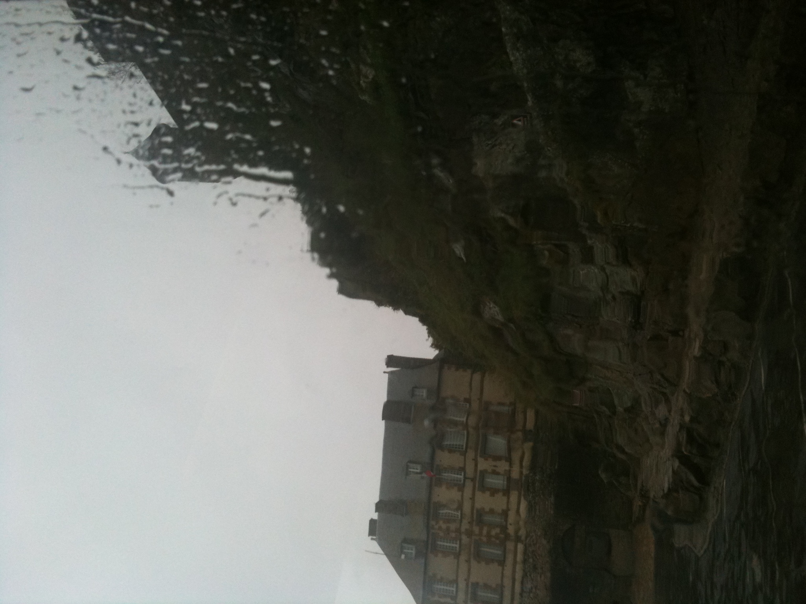

Rapport d'expertise inforensique
********************************

Résumé
======

N° du Parquet : 1015800108

N° Instruction : 3/11/31

Procédure correctionnelle

Personne mise en examen : M. Zouzou

Qualifications : Vol de voiture

Mission : expertise d’une clef USB de marque « Scandisk »

Environnement de travail et outils utilisés
===========================================

L'expertise a été réalisée sous GNU/Linux, assistée des outils suivants :

#. ``exiftool`` pour l'analyse des images

#. ``ls -l`` pour vérifier les dernières dates de modifications d'un fichier

#. ``file`` pour connaître le type réel d'un fichier

#. ``xxd`` pour convertir un texte en représentation hexadécimale et inversement 

#. ``photorec`` pour récupérer les fichiers supprimés d'un disque mais on perd le nom du fichier

#. ``sleuthkit`` boîte à outils inforensique

    * ``fls <file.img>`` pour lister tous les fichier supprimés ou non se trouvant sur l'image du
    disque, ainsi que leur index

    * ``icat <file.img> <inodeOfDeletedFile> > fileout`` permet de récupérer le fichier indexé par
    un numéro de noeud donné.  

    * ``mactime`` retrace en ASCII la chronologie de modification des fichiers se trouvant dans une
      image

#. ``7z`` du paquet **p7zip-full** pour décompresser une archive 7z

#. ``rarcrack`` pour trouver le mot de passe utilisé pour chiffrer une archive 7z

#. ``fcrackzip`` pour trouver le mot de passe utilisé pour chiffrer une archive zip

Identification et copie du scellé n° 1
=======================================

Le scellé n°1 est une clef USB de marque « Scandisk » , d’une capacité approximative de
2Gio. Elle est
ici identifiée par ``/dev/sdc``, information révelée par ``dmesg``.
Sa capacité exacte est de 2000682496 octets comme révelé par l’outil ``blockdev`` ::

    $ blockdev --getsize64 /dev/sdc
    2000682496

Afin de vérifier l’intégrité des données, nous avons relevé deux empreintes des données
présentee sur la
clef à l’aide des fonctions de hashage md5 et sha256 ::

    # md5sum /dev/sdc
    566144be8677312d7c9706618bab39be
    # sha256sum /dev/sdc
    d26536c335658a0954996a44d1f7114e5d29543ffcdd3dab04487e1e61794273

Le scellé n°1 a était copié avec la commande ``dd`` ::

    # ionice -c 3 dd if=/dev/sdc of=scelle.img bs=1M

L’intégrité des données a immédiatement été vérifié. Dans la suite de ce rapport, toutes
les analyses
effectuées ont été lancé à partir d’une copie non altérée des données originelles.

Données présentes sur la clef USB
=================================

La clef est formatée en ``vfat`` comme le révèle la commande ``mount`` ::

    # losetup /dev/loop0 scelle-copie.img
    # mount -o ro /dev/loop0 /mnt
    $ mount | grep /mnt
    /dev/loop0 on /mnt type vfat (ro,relatime,fmask=0022,dmask=0022,[...]

On y trouve les fichiers suivants ::

    $ ls -la /mnt
    total 13076
    drwxr-xr-x  2 root root   16384  1 janv.  1970 .
    drwxr-xr-x 23 root root    4096 24 nov.  09:56 ..
    -rwxr-xr-x  1 root root   23040  6 oct.   2010 Liste musique.xls
    -rwxr-xr-x  1 root root  883579  6 oct.   2010 Photo 066.jpg
    -rwxr-xr-x  1 root root 1540224  6 oct.   2010 be cool.mp3
    -rwxr-xr-x  1 root root 1441920  6 oct.   2010 be like a bee.mp3
    -rwxr-xr-x  1 root root 1730688  6 oct.   2010 chinese landscape.mp3
    -rwxr-xr-x  1 root root 1845248  6 oct.   2010 construction.mp3
    -rwxr-xr-x  1 root root 2312320  6 oct.   2010 pariba.mp3
    -rwxr-xr-x  1 root root 1550464  6 oct.   2010 swirl of smoke.mp3
    -rwxr-xr-x  1 root root 1861760  6 oct.   2010 the roof is on fire.mp3
    -rwxr-xr-x  1 root root   93561  6 oct.   2010 the whirling dancers.mp3

À l’exception du fichier « the whirling dancers.mp3 » , les fichiers audio semblent
valides et sont identiquee
aux fichiers originels que l’on peut trouver sur internet (comparaison effectuée à l’aide
d’une somme de
hashage ``sha256``).
Finalement, les fichiers semblant dignes d’intérêt sont :
* Liste musique.xls
* Photo 066.jpg
* the whirling dancers.mp3

Ci-dessous, la photo dite « 066 » , tourné de 90° dans le sens horaire :

Informations recueillies 
========================

À partir de ces commandes on tire les premières informations suivantes :

* Le fichier **the whirling dancers.mp3** n'est pas un fichier audio mp3 comme son extension
l'indique. C'est un fichier de données (*data file*)

* Les fichiers du scellé ont été modifiés pour la dernière fois le **06 Octobre 2010**

* Liste musique.xls:: 

	Composite Document File V2 Document, Little Endian, Os:
	Windows, Version 6.1, Code page: 1252, Author: Microsoft Corporation, Last Saved By:
	RMDSIC, Name of Creating Application: Microsoft Excel, Last Printed: Tue Sep 27 17:54:19
	2011, Create Time/Date: Sun Oct 20 12:03:58 1996, Last Saved Time/Date: Tue Sep 27
	17:55:10 2011, Security: 0

* La Photo a été prise par un Apple iphone 3GS, sans flash,  le 01 octobre 2010 à 18:55:59 et modifiée
  le 06 octobre 2010 à 21:29:06+02:00 (heure internationale GMT et 23:29:06 heure locale)
 Il se trouvait donc au fuseau horaire GMT+2 (heure d'été) au moment de la modification de la
photo.

En ouvrant le fichier **the whirling dancers.mp3** avec un éditeur tel que *vim* par
exemple, et en appliquant la commande ``:%!xxd`` à ce fichier, on se rend compte que le
fichier contient l'indication **JFIF** (*JPEG File Interchange Format*). Il s'agirait donc
d'une image JPEG dont **l'entête a été modifiée!!!**

`Le site suivant <http://sylvain.fish.free.fr/JPEG_SIZE/Read_jpeg_size.htm>`_ nous donne
plus d'informations relatives à la structure d'un fichier JPEG.

Il en ressort principalement que :

* Tous fichiers JPEG doivent commencer par ``0xff 0xd8`` c'est le **SOF** (*Start of Image*)

* Ils sont ensuite composés de blocs(*frames*) qui commencent par ``0xff`` qui marque le
  début d'un bloc

* Ensuite vient l'indicateur de type de bloc ``0xe0`` (*Frame Identifier*)

* Et la longueur du bloc écrite sur deux octets.

Ce qui donne par exemple:: 
	00000000: ffd8 ffe0 0010

qui est une image dont le premier bloc est identifié par ``e0`` et de longueur ``0x10`` soit
16 octets.

En appliquant ceci au fihier binaire **the whirling dancers.mp3** 
c'est-à dire en remplaçant les premiers caractères par ``00000000: ffd8 ffe1`` soit en binaire
la séquence ``ÿØÿà``, et en renommant le fichier en **the whirling dancers.jpg** on trouve
enfin l'image cachée sous cette suite de chiffres.

On peut alors visualiser l'image ci-dessous dont les informations complètent celles de la
photo trouvée dans le scellé
 
.. image:: img/thewhirlingdancers.jpg

Données éffacées
================

Chronologie de création, d'accès et de modifications des fichiers du scellé
----------------------------------------------------------------------------

Pour un système de fichier FAT, ``mactime`` nous donne la chronologie suivante, créée à 
partir d'un fichier généré par la commande ``fls -m``

.. csv-table:: Chronologie de création, d'accès et de modification des fichiers
	:header: "Date", "Size (Bytes)", "Type", "Mode", "UID", "GID", "Inode", "File Name"

	"Thu Jan 01 1970 01:00:00",1730688,N/A,r/rr-xr-xr-x,0,0,10,"/chinese landscape.mp3"
	"Thu Jan 01 1970 01:00:00",1845248,N/A,r/rr-xr-xr-x,0,0,13,"/construction.mp3"
	"Thu Jan 01 1970 01:00:00",83416,N/A,r/rr-xr-xr-x,0,0,14,"/_tin.7z (deleted)"
	"Thu Jan 01 1970 01:00:00",23040,N/A,r/rr-xr-xr-x,0,0,17,"/Liste musique.xls"
	"Thu Jan 01 1970 01:00:00",2312320,N/A,r/rr-xr-xr-x,0,0,18,"/pariba.mp3"
	"Thu Jan 01 1970 01:00:00",883579,N/A,r/rr-xr-xr-x,0,0,20,"/Photo 066.jpg"
	"Thu Jan 01 1970 01:00:00",1550464,N/A,r/rr-xr-xr-x,0,0,23,"/swirl of smoke.mp3"
	"Thu Jan 01 1970 01:00:00",1861760,N/A,r/rr-xr-xr-x,0,0,26,"/the roof is on fire.mp3"
	"Thu Jan 01 1970 01:00:00",93561,N/A,r/rr-xr-xr-x,0,0,29,"/the whirling dancers.mp3"
	"Thu Jan 01 1970 01:00:00",1540224,N/A,r/rr-xr-xr-x,0,0,4,"/be cool.mp3"
	"Thu Jan 01 1970 01:00:00",1441920,N/A,r/rr-xr-xr-x,0,0,7,"/be like a bee.mp3"
	"Wed Oct 06 2010 19:29:14",83416,Written,r/rr-xr-xr-x,0,0,14,"/_tin.7z (deleted)"
	"Wed Oct 06 2010 20:29:04",1730688,Created,r/rr-xr-xr-x,0,0,10,"/chinese landscape.mp3"
	"Wed Oct 06 2010 20:29:04",1845248,Created,r/rr-xr-xr-x,0,0,13,"/construction.mp3"
	"Wed Oct 06 2010 20:29:04",23040,Created,r/rr-xr-xr-x,0,0,17,"/Liste musique.xls"
	"Wed Oct 06 2010 20:29:04",2312320,Created,r/rr-xr-xr-x,0,0,18,"/pariba.mp3"
	"Wed Oct 06 2010 20:29:04",883579,Created,r/rr-xr-xr-x,0,0,20,"/Photo 066.jpg"
	"Wed Oct 06 2010 20:29:04",1550464,Created,r/rr-xr-xr-x,0,0,23,"/swirl of smoke.mp3"
	"Wed Oct 06 2010 20:29:04",1861760,Created,r/rr-xr-xr-x,0,0,26,"/the roof is on fire.mp3"
	"Wed Oct 06 2010 20:29:04",93561,Created,r/rr-xr-xr-x,0,0,29,"/the whirling dancers.mp3"
	"Wed Oct 06 2010 20:29:04",1540224,Created,r/rr-xr-xr-x,0,0,4,"/be cool.mp3"
	"Wed Oct 06 2010 20:29:04",1441920,Created,r/rr-xr-xr-x,0,0,7,"/be like a bee.mp3"
	"Wed Oct 06 2010 20:29:06",1730688,Written,r/rr-xr-xr-x,0,0,10,"/chinese landscape.mp3"
	"Wed Oct 06 2010 20:29:06",1845248,Written,r/rr-xr-xr-x,0,0,13,"/construction.mp3"
	"Wed Oct 06 2010 20:29:06",23040,Written,r/rr-xr-xr-x,0,0,17,"/Liste musique.xls"
	"Wed Oct 06 2010 20:29:06",2312320,Written,r/rr-xr-xr-x,0,0,18,"/pariba.mp3"
	"Wed Oct 06 2010 20:29:06",883579,Written,r/rr-xr-xr-x,0,0,20,"/Photo 066.jpg"
	"Wed Oct 06 2010 20:29:06",1550464,Written,r/rr-xr-xr-x,0,0,23,"/swirl of smoke.mp3"
	"Wed Oct 06 2010 20:29:06",1861760,Written,r/rr-xr-xr-x,0,0,26,"/the roof is on fire.mp3"
	"Wed Oct 06 2010 20:29:06",93561,Written,r/rr-xr-xr-x,0,0,29,"/the whirling dancers.mp3"
	"Wed Oct 06 2010 20:29:06",1540224,Written,r/rr-xr-xr-x,0,0,4,"/be cool.mp3"
	"Wed Oct 06 2010 20:29:06",1441920,Written,r/rr-xr-xr-x,0,0,7,"/be like a bee.mp3"
	"Wed Sep 28 2011 00:00:00",1730688,Accessed,r/rr-xr-xr-x,0,0,10,"/chinese landscape.mp3"
	"Wed Sep 28 2011 00:00:00",1845248,Accessed,r/rr-xr-xr-x,0,0,13,"/construction.mp3"
	"Wed Sep 28 2011 00:00:00",83416,Accessed,r/rr-xr-xr-x,0,0,14,"/_tin.7z (deleted)"
	"Wed Sep 28 2011 00:00:00",23040,Accessed,r/rr-xr-xr-x,0,0,17,"/Liste musique.xls"
	"Wed Sep 28 2011 00:00:00",2312320,Accessed,r/rr-xr-xr-x,0,0,18,"/pariba.mp3"
	"Wed Sep 28 2011 00:00:00",883579,Accessed,r/rr-xr-xr-x,0,0,20,"/Photo 066.jpg"
	"Wed Sep 28 2011 00:00:00",1550464,Accessed,r/rr-xr-xr-x,0,0,23,"/swirl of smoke.mp3"
	"Wed Sep 28 2011 00:00:00",1861760,Accessed,r/rr-xr-xr-x,0,0,26,"/the roof is on fire.mp3"
	"Wed Sep 28 2011 00:00:00",93561,Accessed,r/rr-xr-xr-x,0,0,29,"/the whirling dancers.mp3"
	"Wed Sep 28 2011 00:00:00",1540224,Accessed,r/rr-xr-xr-x,0,0,4,"/be cool.mp3"
	"Wed Sep 28 2011 00:00:00",1441920,Accessed,r/rr-xr-xr-x,0,0,7,"/be like a bee.mp3"
	"Wed Sep 28 2011 20:28:42",83416,Created,r/rr-xr-xr-x,0,0,14,"/_tin.7z (deleted)"

L'une des informations que l'on peut tirer de ce tableau est que l'image contient une
archive 7z qui a été suppimée. Il convient donc de récupérer cette archive et de trouver
ce qui s'y cache comme informations supplémentaires.

Ce qui se se cache sous l'archive
=================================

La commande ``icat`` de la boîte à outils sleuthkit nous permet de récupérer le fichier
supprimé de l'image. Une fois récupérer on se rend compte que l'archive est protégée par
un mot de passe. 
Une attaque en force-brute de l'archive via le logiciel **rarcrak** en se limitant dans un premier
temps à la recherche d'un mot de passe uniquement composé de lettre miniscules nous permet
de trouver après quelques heures d'attentes le mot de passe de l'archive. **itin** !!!
il fallait y penser en voyant le nom du fichier.

Une fois l'archive dézipée on trouve une nouvelle archive zip à l'intérieur. Celle-ci est
également chiffrée ! Pour tant de précaution elle doit bien cachée une information
cruciale. On n'est pas au bout de nos peines.

L'outil ``fcrackrzip`` de sleuthkit nous permet de trouver le mot de passe en limitant
cette fois ci l'alphabet à des chiffres. Mot de passe trouvé : **654321**
Ce code peut aussi être trouvé dans le fichier excel *Liste Musiques.xls* car en
l'imprimant dans un fichier pdf on a deux pages dont l'une correspondant à la feuille de
calcule numéro 3 est vide. Quelque chose doit dont y être écris mais de manière illisible
(du blanc sur du blanc par exemple). En changeant en noir la couleur de fond du fichier
excel on trouve les mots : **Code : 654321** Bien pensé tout de même cette petite
mascarade.

On trouve dès lors le fameux trésor caché dans l'archive une image de carte  et un fichier htm traçant l'itinéraire de
Toulouse au Mont Saint-Michel.

L'image peut être visualisée ci-dessous 

.. image:: img/image_map.png

La commande exiftool sur l'image gif trouvée nous indique que l'image a été générée le 04
octobre 2010 à 11h 07min 38 s GMT+2

``File Modification Date/Time     : 2010:10:04 11:07:38+02:00``

Conclusion
==========
Compte tenu :

* de la photo dites « 066 » , ainsi que la photo masqué sous le nom de «
the-whirling-dancers.mp3 » ;

* de l’identification du bâtiment représenté par celle-ci sur une photo du Mont Saint
Michel ;

* de l’horodatage de la photo au 1er octobre 2010 ;

* de la cohérence avec le temps pluvieux annoncé par météo France sur le mont Saint Michel
en date
du 1er octobre 2010 ;

* de la feuille de route et du plan associé pour aller de Toulouse au Mont Saint Michel ;
l’utilisateur de la clef USB peut être localisé au Mont Saint Michel le 1er octobre 2010
avec une certitude très
raisonnable.

D’autre part, il peut être souligné la mise en œuvre de différents moyens visant à masquer
certaines
informations, les motivations de l’utilisateur étant laissées à l’appréciation du tribunal.

Source (Haute Définition) :

`<http://upload.wikimedia.org/wikipedia/commons/9/90/Mont_Saint-Michel_20060330.JPG>`_

